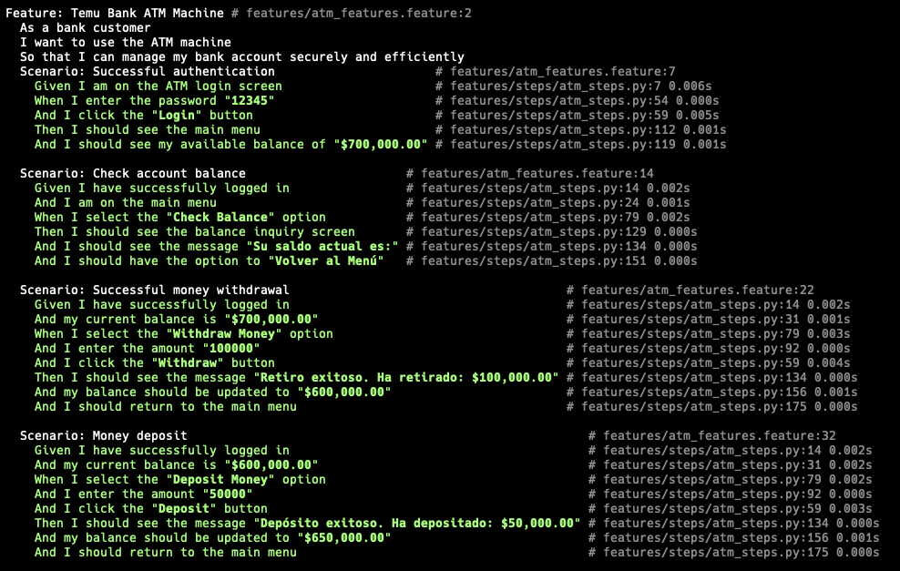
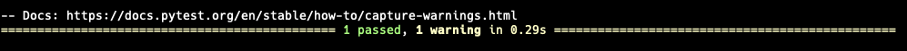
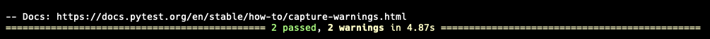
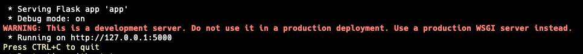
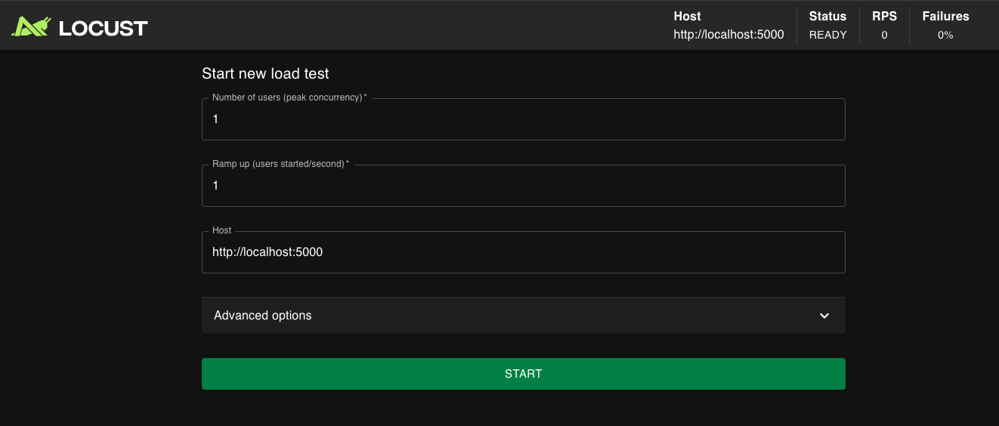
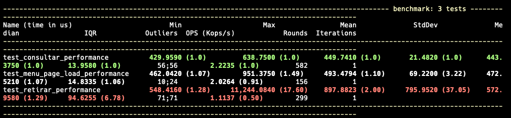

# Cajero Automático 🏧

Sistema de cajero automático desarrollado en Python con Flask.

## 🚀 Instalación y Configuración

### 1. Clonar el Repositorio
```bash
git clone https://github.com/tu-usuario/cajero_automatico.git
cd cajero_automatico
```

### 2. Crear Entorno Virtual
```bash
# Crear entorno virtual
python -m venv venv

# Activar entorno virtual
# En Windows:
venv\Scripts\activate

# En macOS/Linux:
source venv/bin/activate
```


### 3. Instalar Dependencias
```bash
pip install -r requirements.txt
```


### 5. Ejecutar la Aplicación
```bash
python run.py
```

La aplicación estará disponible en `http://localhost:5000`

## 🧪 Ejecutar Pruebas

# Ejecutar pruebas de una ruta específica
pytest tests/


### Pruebas BDD con Behave (Gherkin)
```bash
behave
```




## 🔬 Pruebas Funcionales

### Pruebas Unitarias (Unit Tests)
Verifican el comportamiento de componentes individuales:
```bash
# Ejecutar todas las pruebas unitarias
python -m pytest tests/unit/ -v ```


### Pruebas de Integración
Verifican la interacción entre diferentes módulos del sistema:
```bash
# Ejecutar todas las pruebas de integración
python -m pytest tests/integration/ -v```



### Pruebas Funcionales con Selenium
Verifican el comportamiento end-to-end de la aplicación web:
```bash
# Ejecutar todas las pruebas funcionales
python -m pytest tests/functional/ -v```



## ⚡ Pruebas No Funcionales

### Pruebas de Seguridad
Verifican vulnerabilidades y manejo seguro de datos:
```bash
# Ejecutar todas las pruebas de seguridad
python -m pytest tests/non_functional/test_security.py -v
```


### Pruebas de Carga con Locust
Verifican el comportamiento bajo múltiples usuarios concurrentes:

1. **Iniciar la aplicación** (en una terminal):
   ```bash
   python run.py
   ```


2. **Ejecutar Locust** (en otra terminal):
   ```bash
   locust -f tests/non_functional/locustfile.py --host=http://localhost:5000
   ```


3. **Configurar prueba de carga**:
   - Abrir navegador en `http://localhost:8089`
   - Ingresar número de usuarios a simular (ej. 100)
   - Ingresar tasa de generación de usuarios (ej. 10 por segundo)
   - Hacer clic en "Start swarming"
   - Observar gráficos y estadísticas en tiempo real
   - Al finalizar, hacer clic en "Stop" y descargar resultados

### Pruebas de Rendimiento con pytest-benchmark
Miden el tiempo de ejecución y rendimiento de funciones críticas:
```bash
# Ejecutar todas las pruebas de rendimiento
python -m pytest tests/non_functional/test_performance.py 
```


